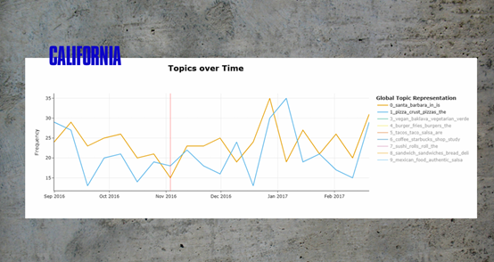
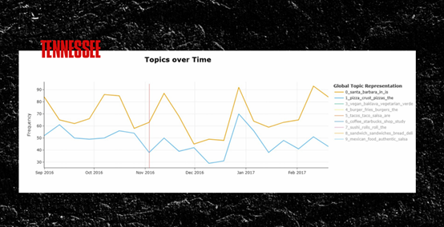
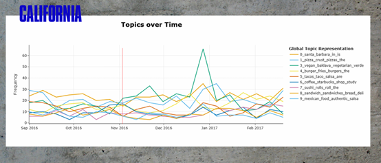
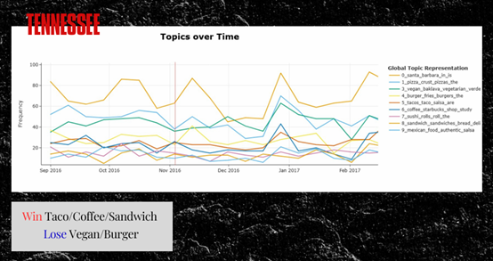

# Results and Business Insights

## State-Level Sentiment Analysis

### California
Post-election analysis indicates noticeable sentiment shifts in California Yelp reviews. Compared to the pre-election period, neutral and negative reviews increased, suggesting that the political outcome may have influenced how consumers expressed dissatisfaction in restaurant reviews.

---

### Tennessee
In contrast, sentiment changes in Tennessee were less pronounced. Review sentiment remained relatively stable, indicating that consumer expressions were less affected by the election outcome in this Republican-leaning state.

---

## Topic Analysis: “Win” vs. “Lose”

Using zero-shot topic modeling, review content was analyzed to identify themes associated with emotionally charged language following the election.

- **Win-related themes** were commonly associated with:
  - Taco
  - Coffee
  - Sandwich

- **Lose-related themes** were commonly associated with:
  - Vegan
  - Burger

These themes suggest that emotional framing may influence not only sentiment polarity but also the types of dining experiences discussed by reviewers.

---

## Cross-State Comparison: California vs. Tennessee

A direct comparison between California and Tennessee highlights distinct post-election sentiment trajectories. California showed a stronger shift toward negative and neutral sentiment, while Tennessee’s sentiment distribution remained comparatively stable.

This contrast reinforces the idea that political alignment and election outcomes may influence consumer sentiment in online reviews.

---

## Business Insights

### Political Events Influence Consumer Sentiment
The analysis demonstrates that major political events can spill over into consumer behavior, affecting how customers express opinions in online restaurant reviews.

### Reviews Reflect More Than Food Quality
Customer reviews are shaped not only by service and food quality but also by broader emotional and psychological contexts, including political stress.

### Strategic Implications for Businesses
- Businesses should be aware of sentiment volatility during politically sensitive periods.
- Marketing and customer engagement strategies may need adjustment during times of heightened social tension.
- Monitoring sentiment trends can help businesses proactively manage brand perception.

---

## Key Takeaway
Consumer sentiment in online restaurant reviews is influenced by both personal dining experiences and external socio-political events. In politically polarized environments, businesses must recognize that broader societal factors can affect customer perception and feedback.
